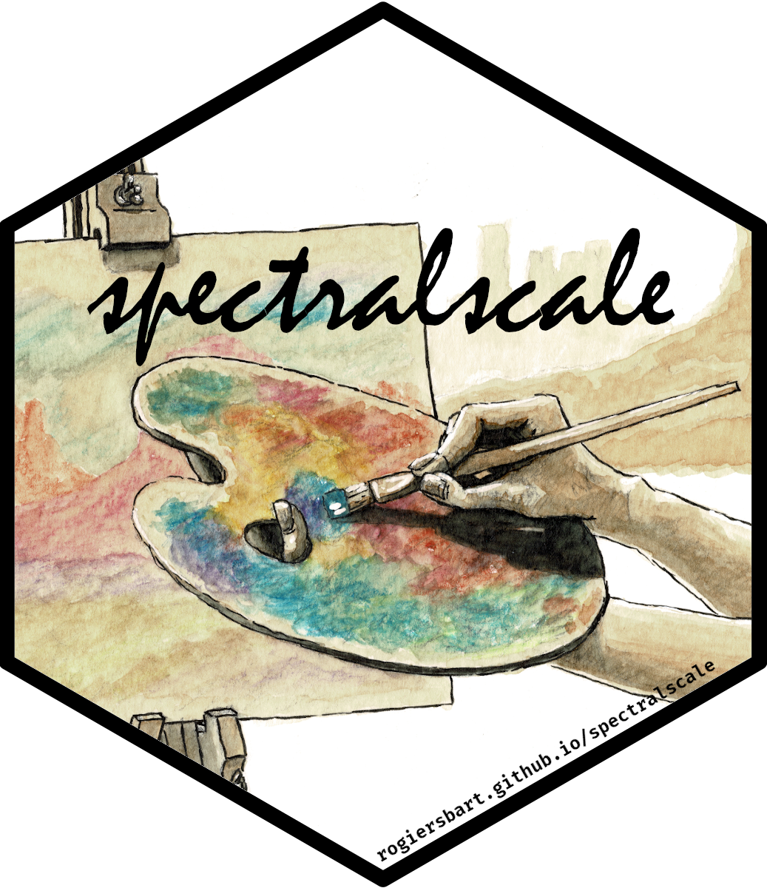

<!-- README.md is generated from README.Rmd. Please edit that file -->

```{r, include = FALSE}
knitr::opts_chunk$set(
  collapse = TRUE,
  comment = "#>",
  fig.path = "man/figures/README-",
  out.width = "100%"
)
```

# spectralscale<br><small><font color="#333333">A consistent set of Spectral-based palettes and scales</font></small>

<!-- badges: start -->
[](https://www.tidyverse.org/lifecycle/#experimental)
[](https://CRAN.R-project.org/package=spectralscale)
<!-- badges: end -->

The goal of `spectralscale` is to provide a set of palettes and corresponding 
continuous, discrete and binned colour and fill scales based on a consistent 
set of colours. These should cover different purposes like those typical for
sequential, diverging, qualitative and paired palettes, and preferably be robust
with respect to different types of colour vision deficiency.

This is obviously quite a challenge, and I'm not sure it is even feasible, but
there are some excellent tools available to start from: The palettes are
currently all based on ColorBrewer's Spectral palette, as approximated by the 
recent, and excellent `colorspace` package.

## Install

You can install the latest version of `spectralscale` with any of the following:

``` r
renv::install("rogiersbart/spectralscale")
pak::pkg_install("rogiersbart/spectralscale")
remotes::install_github("rogiersbart/spectralscale")
```

## Use

This is an overview of the current palettes:

```{r palette-overview, echo = FALSE, fig.height = 2, fig.width = 7}
spectralscale:::palette_overview()
```

## Contribute

## Expect

- Many changes in the near future.
