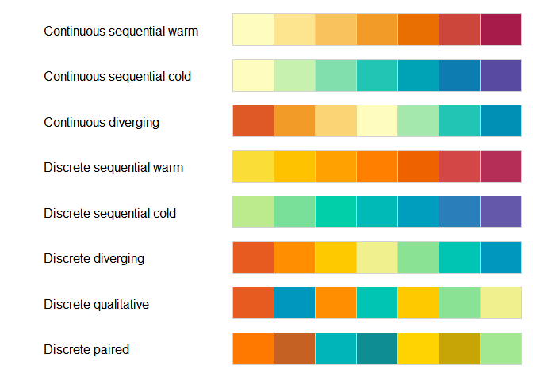

<!-- README.md is generated from README.Rmd. Please edit that file -->

# spectralscale

<!-- badges: start -->

<!-- badges: end -->

The goal of spectralscale is to …

## Installation

You can install the released version of spectralscale from
[CRAN](https://CRAN.R-project.org) with:

``` r
install.packages("spectralscale")
```

## Example

This is a basic example which shows you how to solve a common problem:

``` r
spectralscale::palette_overview()
```


